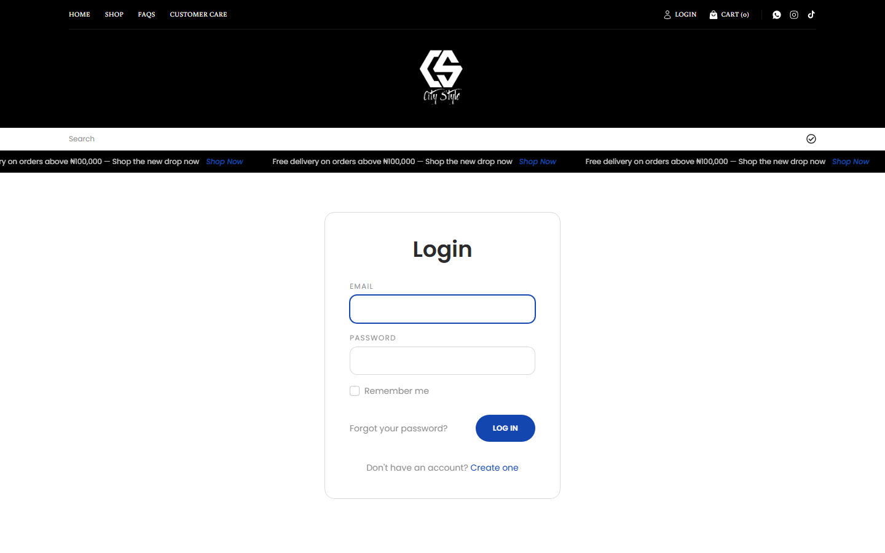
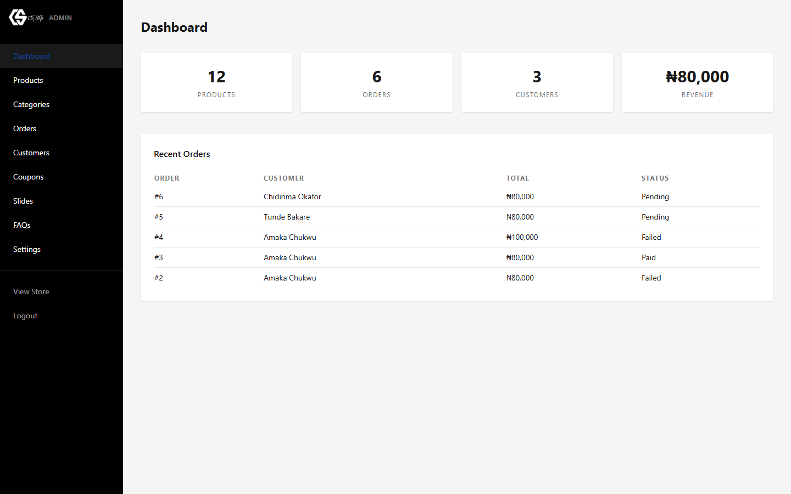
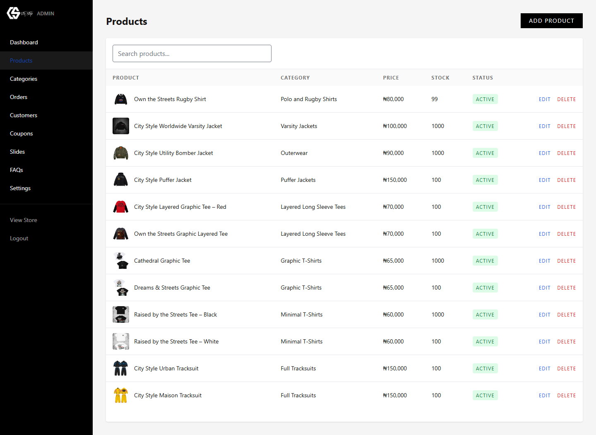
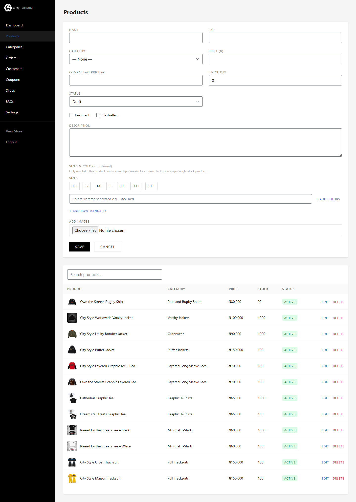
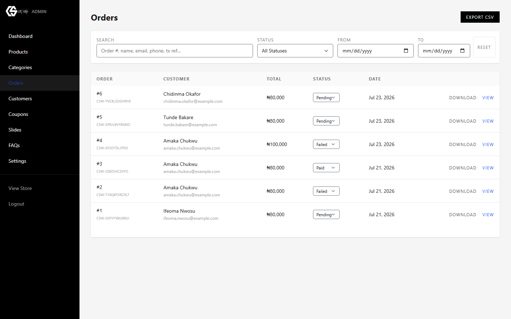
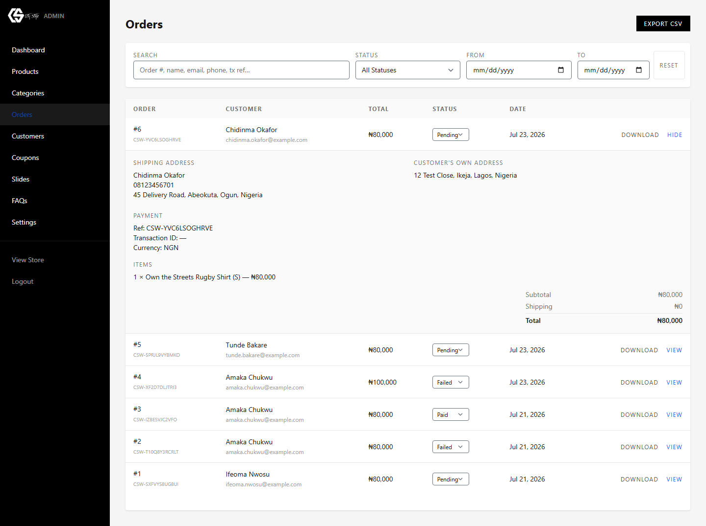
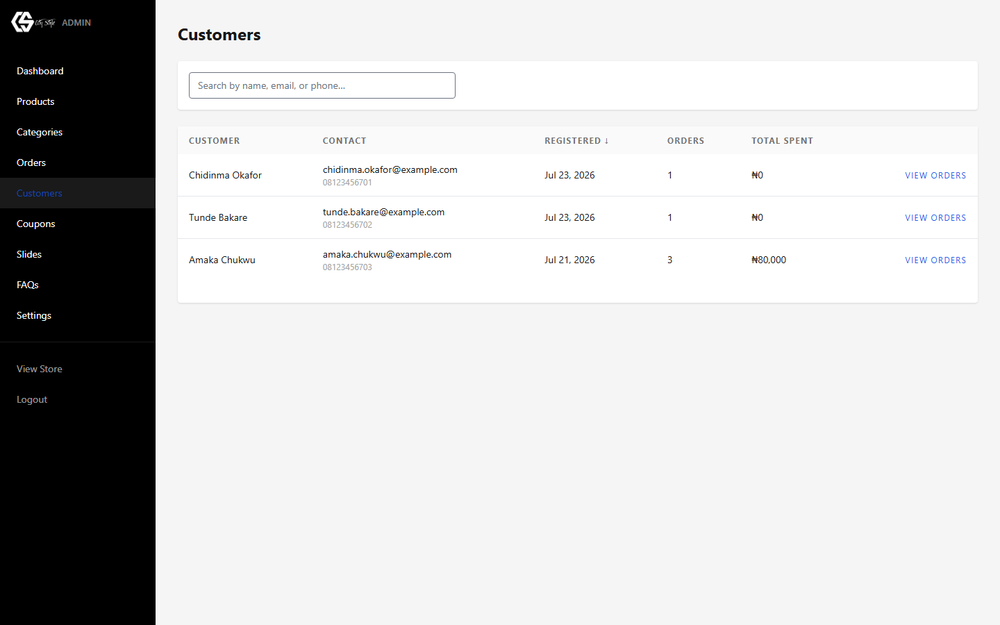
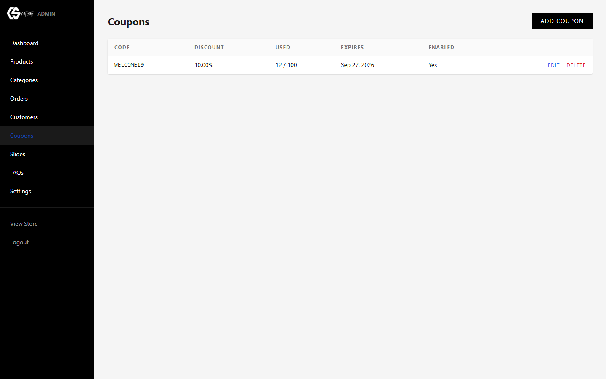
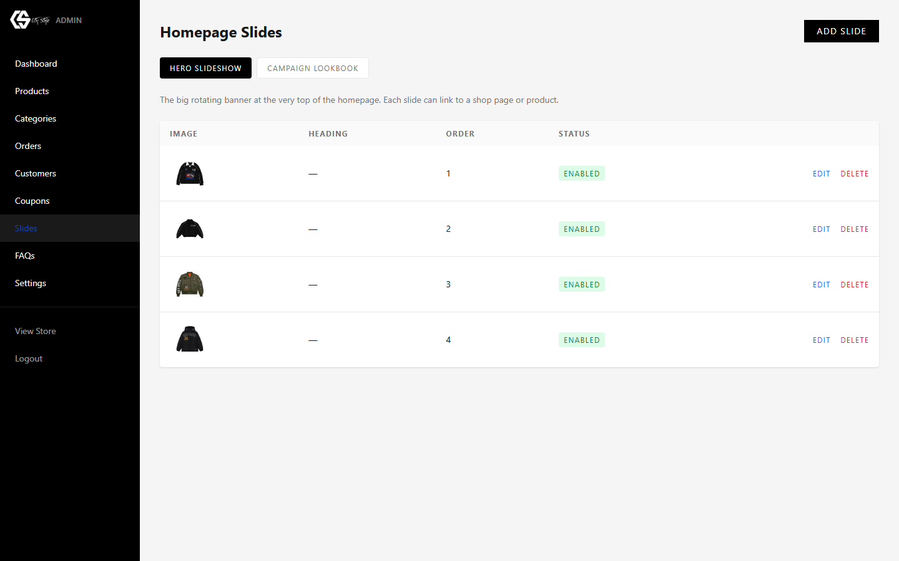
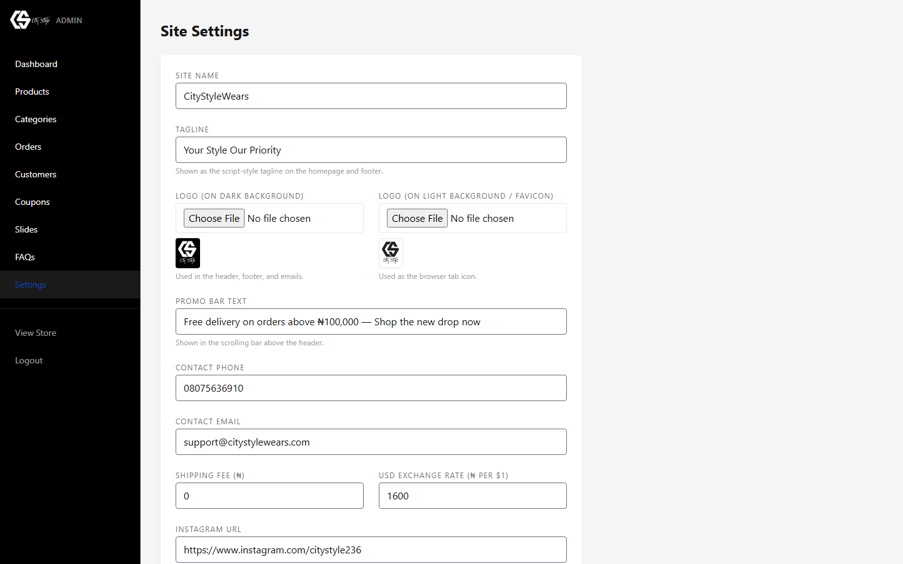

# CityStyleWears

A full-featured e-commerce storefront and admin panel built with Laravel, Livewire, and Tailwind CSS, with Flutterwave payment integration.

## Table of Contents

- [Features](#features)
- [Screenshots](#screenshots)
- [Tech Stack](#tech-stack)
- [Project Structure](#project-structure)
- [Installation](#installation)
- [Configuration](#configuration)
- [URL Structure](#url-structure)
- [Documentation](#documentation)
- [Security](#security)
- [License](#license)

## Features

**Storefront**

- Product catalog with categories, brands, variants, and image galleries
- Cart, checkout, and order confirmation flow
- Flutterwave payment integration with webhook-verified callbacks
- Customer accounts — order history and profile management
- Product reviews, wishlists, and coupon codes
- FAQs and contact page with mail notifications

**Admin Panel**

- Dashboard with product, order, customer, and revenue counts
- Product, category, and brand management
- Order management with CSV export and PDF invoice download
- Customer management
- Coupon management
- Homepage slide/campaign management
- FAQ management
- Site settings (general, mail, chat)

## Screenshots

| | |
|---|---|
|  |  |
| Login | Dashboard |

| | |
|---|---|
|  |  |
| Products list | Add/edit product |

| | |
|---|---|
|  |  |
| Orders list | Order detail |

| | |
|---|---|
|  |  |
| Customers list | Coupons |

| | |
|---|---|
|  |  |
| Homepage slides | Site settings |

More screenshots — categories, campaign slides, FAQs, and mail/chat settings — are in [docs/ADMIN_GUIDE.md](docs/ADMIN_GUIDE.md).

## Tech Stack

| | |
|---|---|
| Backend | PHP 8.2, Laravel 12 |
| Admin UI | Livewire 3 |
| Frontend | Tailwind CSS, Alpine.js |
| Build tool | Vite |
| Payments | Flutterwave |
| PDF export | barryvdh/laravel-dompdf |

## Project Structure

```
citystylewears.com/
├── app/
│   ├── Http/Controllers/     # Storefront + admin controllers
│   ├── Livewire/Admin/       # Admin panel Livewire components
│   ├── Models/                # Product, Order, Category, Coupon, Slide, Faq, ...
│   ├── Services/              # FlutterwaveService
│   └── Mail/                  # Order confirmation, contact form mail
├── database/migrations/       # Schema for products, orders, users, ...
├── resources/views/           # Blade templates
├── routes/web.php             # Storefront + admin routes
└── docs/ADMIN_GUIDE.md        # Admin panel user guide (with screenshots)
```

## Installation

### Prerequisites

- PHP 8.2+, Composer
- Node.js + npm
- A database supported by Laravel (SQLite by default, or MySQL/Postgres)

### Steps

```bash
composer install
npm install
cp .env.example .env
php artisan key:generate
php artisan migrate --seed
npm run build
php artisan serve
```

## Configuration

Set the following in `.env` for payments and mail to work:

```
FLUTTERWAVE_PUBLIC_KEY=
FLUTTERWAVE_SECRET_KEY=
FLUTTERWAVE_ENCRYPTION_KEY=
FLUTTERWAVE_SECRET_HASH=

MAIL_MAILER=
MAIL_HOST=
MAIL_PORT=
MAIL_USERNAME=
MAIL_PASSWORD=
```

## URL Structure

| | |
|---|---|
| `/` | Storefront home |
| `/shop` | Product listing |
| `/shop/category/{slug}` | Products by category |
| `/shop/{slug}` | Product detail |
| `/cart`, `/checkout` | Cart and checkout |
| `/account/orders` | Customer order history |
| `/admin` | Admin dashboard |
| `/admin/products`, `/admin/categories`, `/admin/orders`, `/admin/customers`, `/admin/coupons`, `/admin/slides`, `/admin/faqs`, `/admin/settings` | Admin management pages |
| `/webhooks/flutterwave` | Flutterwave payment webhook |

## Documentation

The full admin panel guide — logging in, managing products, categories, orders, customers, coupons, homepage slides, FAQs, and site settings — lives in [docs/ADMIN_GUIDE.md](docs/ADMIN_GUIDE.md).

## Security

| | |
|---|---|
| Admin access | Route-level `auth` + `admin` middleware guards |
| Payment verification | Flutterwave webhook signature checked before marking orders paid |
| SQL injection | Eloquent ORM / query builder with parameter binding throughout |
| Mass assignment | Explicit `$fillable` on Eloquent models |
| Secrets | Payment keys and mail credentials kept in `.env`, excluded from version control |

## License

This project is proprietary and not licensed for public use or redistribution.
