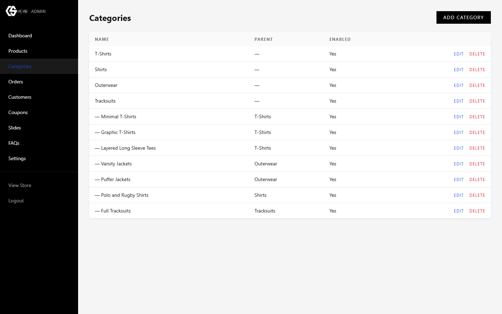
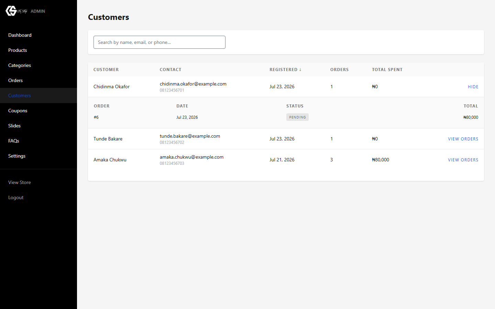
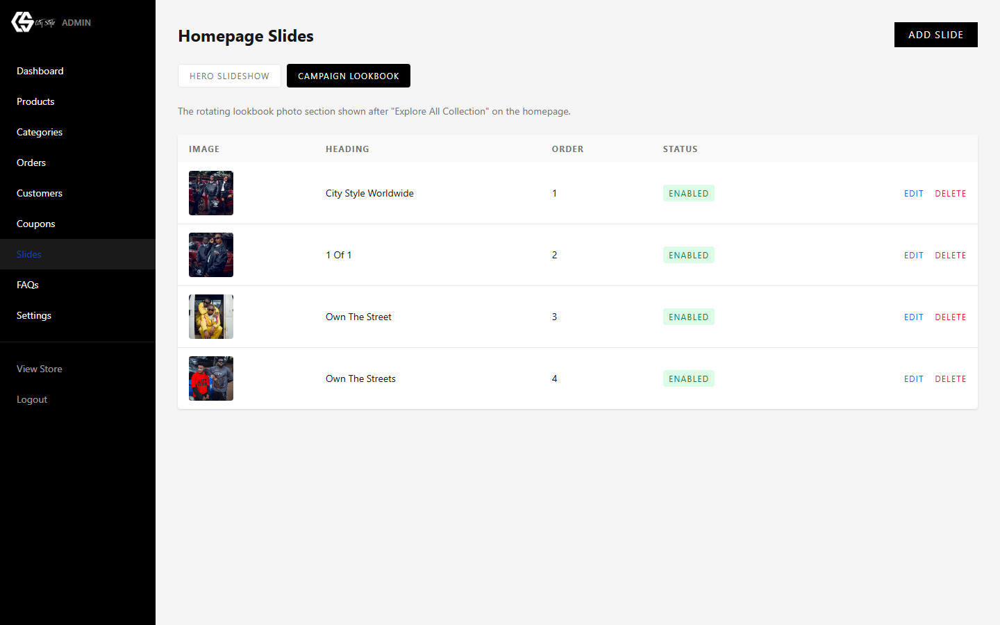
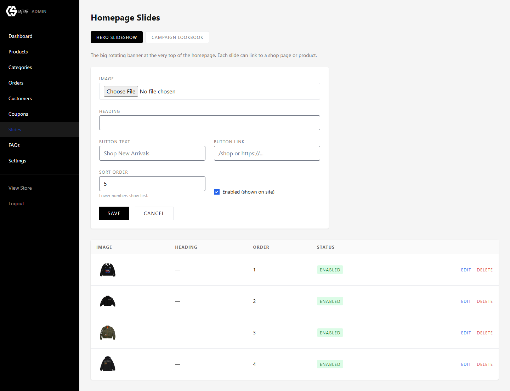
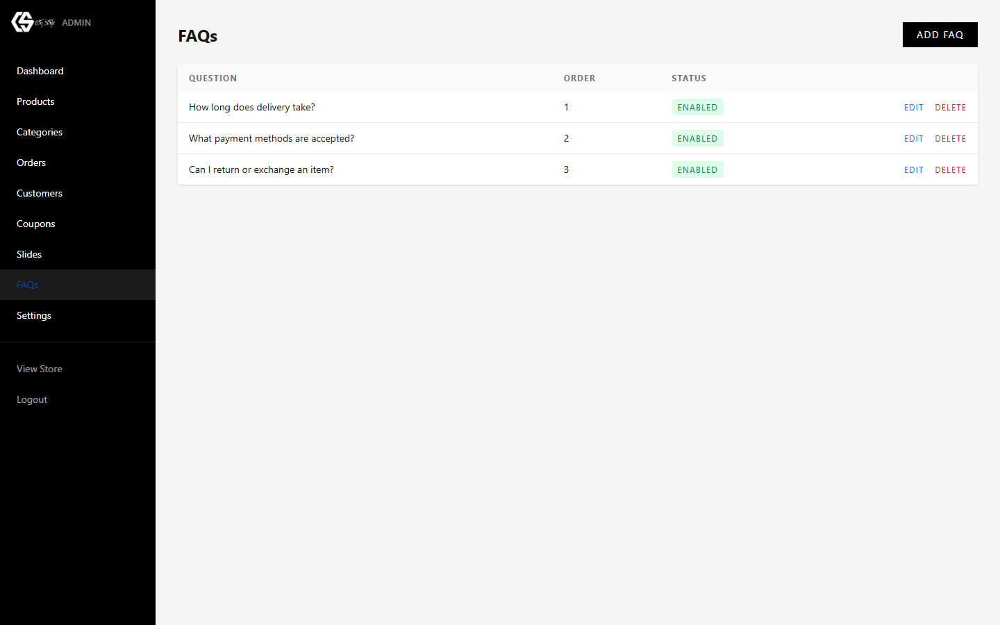
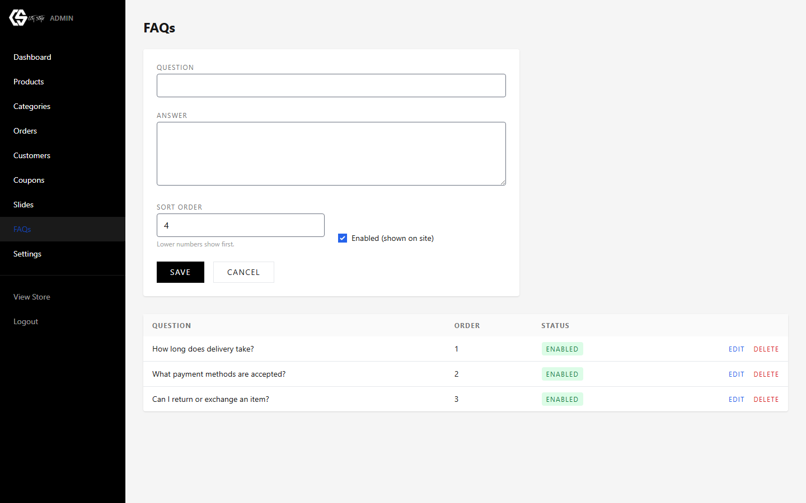
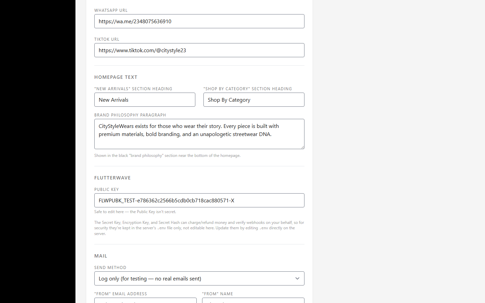
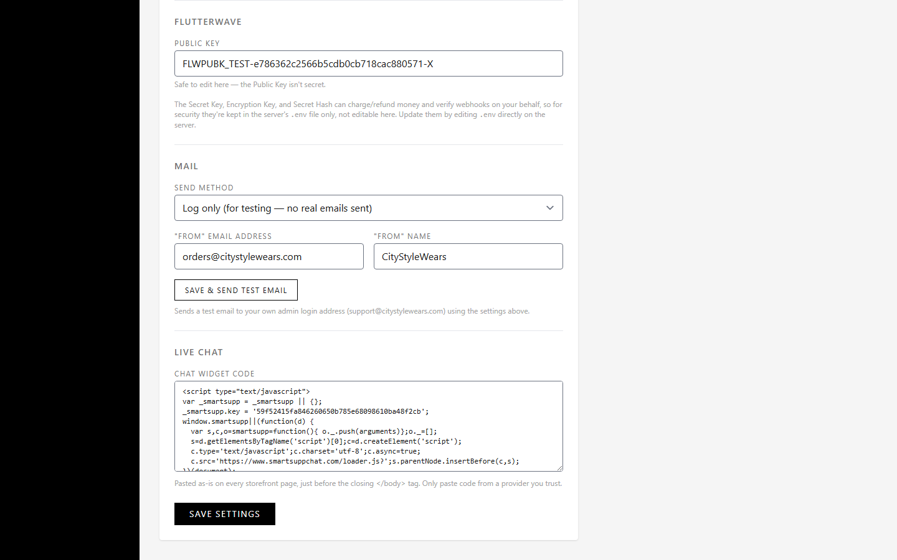

# CityStyleWears — Admin Guide

*Internal reference for the store team. Covers day-to-day use of the admin panel — no coding required. For anything involving the server, deployment, or code changes, contact your developer.*

A version of this guide with nicer formatting is also available as a shared web page — ask your developer for the link if you'd prefer that. This file is the source of truth and lives with the rest of the project.

## Contents

1. [Logging in](#1-logging-in)
2. [Dashboard](#2-dashboard)
3. [Products](#3-products)
4. [Categories](#4-categories)
5. [Orders](#5-orders)
6. [Customers](#6-customers)
7. [Coupons](#7-coupons)
8. [Homepage Slides](#8-homepage-slides)
9. [FAQs](#9-faqs)
10. [Site Settings](#10-site-settings)
11. [Quick Reference](#11-quick-reference)

---

## 1. Logging in

The admin panel lives at `/login` on the store's domain.

1. Go to `citystylewears.com/login`.
2. Enter your admin email address and password.
3. You'll land straight on the Dashboard. If you're ever unsure where you are, the sidebar on the left always shows which section you're in.

> **Forgotten your password?** Use "Forgot your password?" on the login screen — a reset link is emailed to you. If email isn't set up yet on the store (see [Site Settings → Mail](#10-site-settings)), ask your developer to reset it directly.

---

## 2. Dashboard

Your landing page after login — a quick pulse-check on the store.

Four numbers up top: total **Products**, total **Orders**, total **Customers**, and **Revenue** (the sum of every order marked *Paid* or further along). Below that, the five most recent orders, whatever their status.

> Revenue only counts orders that have actually been paid for — an order sitting at "Pending" or "Failed" won't add to that number yet.

---

## 3. Products

Everything for sale in the store — names, prices, stock, photos, sizes, and colors.

### Adding a new product

1. Click **Add Product** in the top-right corner.
2. Fill in the **Name**, an optional **SKU** (your own internal reference code), and pick a **Category**.
3. Set the **Price**. **Compare-at Price** is optional — fill it in only if you want to show a struck-through "was" price next to the real one.
4. Set **Stock Qty** — this is only used if the product has no sizes/colors (see below). Once it comes with variants, stock is tracked per size/color instead.
5. Choose a **Status**: `Draft` keeps it hidden from customers while you're still preparing it; `Active` makes it live; `Sold Out` and `Archived` both hide it from the main shop but keep the record.
6. Tick **Featured** and/or **Bestseller** if this product should appear in those homepage sections.
7. Write a **Description** — this shows on the product's page.
8. If the product comes in more than one size, tick the sizes it's available in under **Sizes & Colors**. If it also comes in specific colors, type them into the colors box (comma separated) and click **+ Add Colors**.
9. Under **Add Images**, choose one or more photos. The first one becomes the product's main photo.
10. Click **Save**.

> Leave Sizes & Colors empty for something that's simply one size fits all, like a cap or a tote bag — the plain Stock Qty field is all it needs.

---

## 4. Categories

The groupings customers browse by — T-Shirts, Outerwear, Tracksuits, and so on.

1. Click **Add Category**.
2. Give it a **Name**. If it's a sub-group of an existing category, choose that as its **Parent Category** — otherwise leave it as "None (Top Level)".
3. **Sort Order** controls left-to-right / top-to-bottom position — lower numbers appear first.
4. Untick **Enabled** to hide a category from the shop temporarily without deleting it.

---

## 5. Orders

Every order placed on the store, with search, filters, invoices, and status updates.

### Finding an order

Type into **Search** to match against an order number, customer name, email, phone, or payment reference. Combine it with the **Status** dropdown or a **From/To** date range to narrow things down further, or click **Reset** to clear all filters.

### Viewing an order

Click **View** on any row to expand its full detail inline: shipping address, the customer's own address if it differs, payment reference, coupon used (if any), a line-by-line item list, and the subtotal / discount / shipping / total breakdown.

### Updating order status

Use the status dropdown directly on an order's row — it saves the moment you pick a new value, no extra "save" click needed.

`Pending` · `Paid` · `Processing` · `Shipped` · `Delivered` · `Cancelled` · `Refunded` · `Failed`

See [Quick Reference](#11-quick-reference) for what each status means and when to use it.

### Downloading an invoice

Click **Download** on any order to get a clean, printable PDF invoice — useful for your own records or if a customer asks for a receipt.

### Exporting to a spreadsheet

Click **Export CSV** in the top-right to download every order that matches your current search/filters as a spreadsheet file, ready to open in Excel or Google Sheets.

---

## 6. Customers

Everyone who's registered an account, and what they've spent.

Search by name, email, or phone at the top. Click any column heading (like **Registered**) to sort by it — click again to flip the order.

**Total Spent** only counts orders that reached Paid, Processing, Shipped, or Delivered — a failed or still-pending order won't inflate a customer's number.

### Seeing a customer's order history

Click **View Orders** next to any customer to expand their full order history right there in the list — no need to jump over to the Orders page and search for them.

---

## 7. Coupons

Discount codes customers can apply at checkout.

1. Click **Add Coupon**.
2. Set the **Code** customers will type in (e.g. `WELCOME10`).
3. Choose **Type** — Percent Off (e.g. 10%) or Fixed Amount Off (e.g. ₦2,000).
4. Set the **Value** to match — a number like `10` for 10%, or `2000` for a flat ₦2,000.
5. **Min Order Amount** stops the coupon applying below a certain cart total — leave blank for no minimum.
6. **Usage Limit** caps how many times the code can be used in total across all customers — leave blank for unlimited.
7. **Expires At** is optional — after that date the code stops working automatically.
8. Untick **Enabled** at any time to switch a code off without deleting it.

---

## 8. Homepage Slides

The two rotating photo sections on the homepage — the big banner at the very top, and the lookbook strip further down.

There are two separate slideshows, switched between with the tabs at the top of this screen:

- **Hero Slideshow** — the large banner at the very top of the homepage. Each slide can carry a button (like "Shop New Arrivals") linking anywhere you choose.
- **Campaign Lookbook** — the rotating photo strip shown further down the homepage, just after "Explore All Collection". No button here, just the photo and its heading.

### Adding or editing a slide

1. Make sure you're on the correct tab first (Hero or Campaign) — new slides are added to whichever tab you're viewing.
2. Click **Add Slide** and choose an **Image** to upload.
3. Add a **Heading** if you want text overlaid on the photo.
4. On the Hero tab only, optionally set **Button Text** and **Button Link** (a shop URL, a specific product, or any external link).
5. **Sort Order** decides the sequence slides rotate in — lower numbers show first.
6. Untick **Enabled** to hide a slide from the live site without deleting it — handy for prepping a slide ahead of time.

> For the best crop on the homepage, use photos with your subject roughly centered — both slideshows crop tightly on smaller screens.

---

## 9. FAQs

The question-and-answer list on the store's FAQs page.

1. Click **Add FAQ**.
2. Type the **Question** as customers would ask it, and the **Answer** underneath.
3. **Sort Order** controls where it falls in the list — lower numbers show first.
4. Untick **Enabled** to hide a question from the live FAQs page without deleting it.

---

## 10. Site Settings

One page covering branding, homepage text, payments, outgoing email, and live chat.

| Field | What it does |
|---|---|
| Site Name | Shown in the browser tab and various places across the site. |
| Tagline | The script-style line shown on the homepage and footer ("Your Style Our Priority"). |
| Logo (dark background) | Used in the header, footer, and emails — should be a light/white logo. |
| Logo (light background) | Used as the browser tab icon (favicon) — should be a dark logo on transparent or white. |
| Promo Bar Text | The scrolling message strip shown above the header. |
| Contact Phone / Email | Shown on the Customer Care page and used as the reply-to for contact form messages. |
| Shipping Fee | The flat delivery fee added at checkout. |
| USD Exchange Rate | How many Naira equal $1 — used anywhere prices show a USD estimate. |
| Instagram / WhatsApp / TikTok URL | Social links shown in the header and footer. |

### Homepage text

Further down the same page, you can edit the wording of two homepage section headings ("New Arrivals" and "Shop By Category") and the longer brand philosophy paragraph shown near the bottom of the homepage.

### Payments (Flutterwave)

Only the **Public Key** is editable here — it isn't secret, so it's safe to update yourself. The Secret Key, Encryption Key, and Secret Hash can move real money and verify payments, so for security they live only in a protected file on the server, not in this panel. Ask your developer if those ever need to change.

### Outgoing mail

Controls how the store sends emails — order confirmations, contact form messages, password resets.

- **Send Method** — choose `SMTP` to send through a real mail provider (Gmail, Zoho, SendGrid, etc.), `Sendmail` to use the web server's own built-in mail sending, or `Log only` for testing, where no real email goes out.
- If you choose SMTP, fill in the **Host**, **Port**, **Username**, **Password**, and **Encryption** given to you by your email provider.
- **"From" Email Address / Name** is what customers see as the sender on every email the store sends.
- Click **Save & Send Test Email** any time to save your changes and immediately fire a test email to your own admin address, so you know right away whether it worked.

> The mail password field never shows your saved password back to you, even after saving — that's normal. Leave it blank when saving other changes to keep the existing password; only type into it when you want to replace it.

### Live chat

Paste the full script snippet from your live chat provider (Smartsupp, Tawk.to, etc.) into **Chat Widget Code** and save — it appears on every page of the storefront immediately, no developer needed. Only ever paste code copied directly from a provider you trust.

---

## 11. Quick Reference

### Order statuses explained

| Status | Meaning |
|---|---|
| **Pending** | Order created, payment not yet confirmed. Normal for the first few seconds after checkout. |
| **Paid** | Payment confirmed. Time to start preparing the order. |
| **Processing** | You've started packing / preparing the order for dispatch. |
| **Shipped** | Order has left the building, on its way to the customer. |
| **Delivered** | Customer has received it. The order is complete. |
| **Cancelled** | Order will not be fulfilled — stock is not affected automatically, so adjust manually if needed. |
| **Refunded** | Money has been returned to the customer outside the site (via Flutterwave directly). |
| **Failed** | Payment did not go through. No action needed — the customer will need to try again themselves. |

### Common questions

**A product isn't showing on the site.**
Check its Status on the Products page — it needs to be `Active` to appear in the shop.

**I want to temporarily stop selling something without deleting it.**
Change its status to `Sold Out` or `Archived` instead of deleting — the record (and its order history) stays intact.

**A coupon isn't working for a customer.**
Check it's still `Enabled`, hasn't passed its `Expires At` date, hasn't hit its `Usage Limit`, and that the cart total meets its `Min Order Amount`.

**Emails aren't arriving.**
Go to [Settings → Mail](#10-site-settings) and use **Save & Send Test Email** — if the test email doesn't arrive either, double-check the SMTP details with your email provider.
